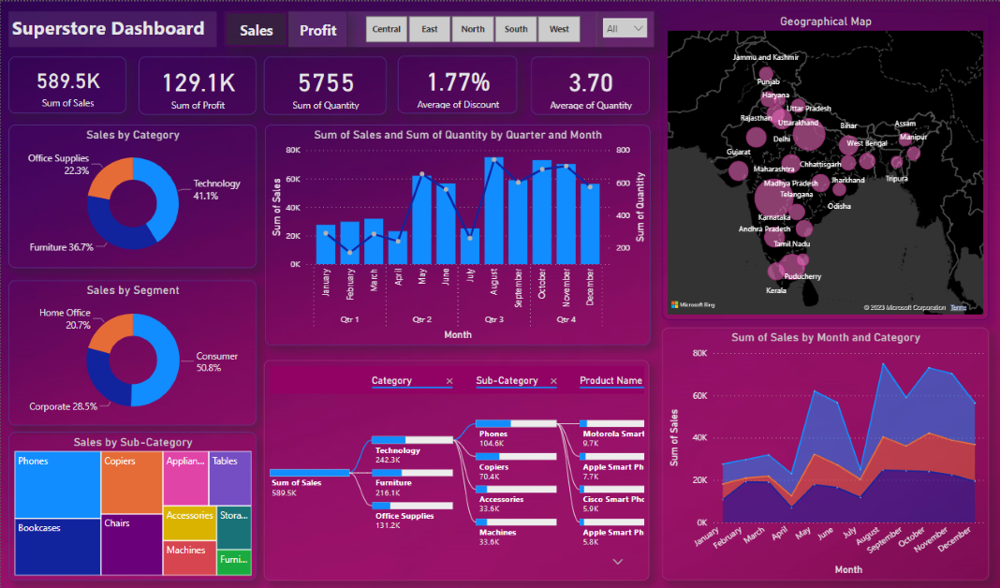

# 📊 Power BI Dashboard — Superstore

This project is part of my **Elevate Labs Data Analyst Internship — Task 2: Data Visualization and Storytelling**.

## 📌 Dashboard

## 🔧 Project Overview

A Power BI dashboard was created using the **Superstore dataset** to visualize sales and profit performance.

### Work Covered

- Connected and explored the Superstore dataset
- Prepared data using Power Query
- Created KPIs for sales and profit performance
- Analyzed sales across different categories and regions
- Used charts to present business insights
- Designed an interactive Power BI dashboard

## 📂 Dataset

The Superstore dataset contains information about orders, customers, products, sales, profit, shipping, categories, and regions.

## 🛠️ Tools Used

**Power BI • Power Query • DAX**

## 🎯 Internship Task

**Elevate Labs — Data Analyst Internship**  
**Task 2: Data Visualization and Storytelling**
